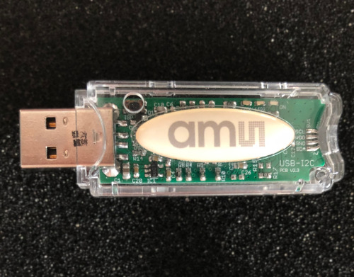

# USB-I2C-dongle

This is the (signed) driver for the USB-I2C dongle from ams (now ScioSense). The driver is needed for Windows 7 and 8. Windows 10 does not need a driver. Linux/Unix/Mac do not need a driver.

## ENS210
It is suitable to work with eval kits for ENS210

More information can be found here: https://www.sciosense.com/products/relative-humidity-and-temperature-sensors/evaluation-kit-for-ens210/

## CCS801
It is also suitable to work with eval kits for CCS801

More information can be found here: https://www.sciosense.com/products/environmental-sensors/evaluation-kit-for-ccs801/

### ScioSense is a Joint Venture of ams AG 
